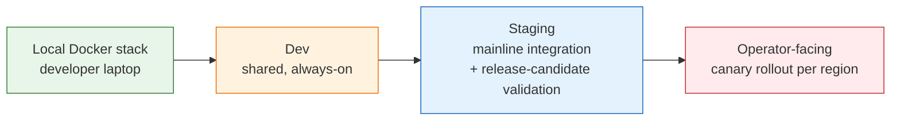

# Environment Strategy

> Why test environments were the hardest part of the platform — and how Docker, isolation, and a heavily-loaded staging tier kept the suite trustworthy without a dedicated pre-prod.

---

## The problem environments solve (and create)

In most domains, a "test environment" is a deployment of the product wired to test data. In telecom automation, an environment also has to credibly represent:

- **Multiple network-element vendors**, each with its own quirks, response timings, and partial-standard compliance.
- **Geographically distributed topologies**, where latency and partial-failure modes matter.
- **Multi-tenant isolation**, because one platform serves competing operators.
- **Realistic scale** — a topology with 50 elements behaves nothing like one with 5,000.

A test suite that passes against a toy environment and fails against a real one isn't an asset; it's a liability that hides risk. So the environments themselves had to be part of the architecture, not an afterthought.

---

## The environment tiers we actually had

There was **no dedicated pre-production environment**. Staging had to do double duty: mainline integration *and* release-candidate validation. That constraint shaped most of the decisions documented here.

| Tier | Purpose | Vendor mix | Data | Refresh cadence |
|---|---|---|---|---|
| **Local Docker** | Fast iteration, pre-commit smoke | Simulators only | Synthetic, builder-generated | Per test run |
| **Dev** | Shared developer integration | Simulators + 1 reference vendor | Synthetic, refreshed nightly | Nightly |
| **Staging** | Mainline regression + release-candidate validation | Simulators + 2 reference vendors | Anonymised slice of real topology | Weekly |
| **Operator-facing** | Customer rollout, canary per region | Real | Real | N/A |

The discipline: **a test that ran in dev had to run, unchanged, in staging**. Environment differences were absorbed by configuration, never by branching test code.

---

## Living without a pre-prod

The absence of a customer-shaped pre-prod tier was a real constraint, not a virtue. It meant:

- **Staging carried more weight.** It had to be stable enough to gate releases against, which forced earlier investment in environment reliability and observability than would otherwise have been needed.
- **The release-candidate suite was tighter.** Without a customer-shaped tier to catch "shape" issues, the RC subset that ran on staging had to be very deliberate about what it covered — critical paths, the highest-risk multi-vendor flows, and tenant-isolation checks.
- **Canary rollout absorbed more risk.** What a pre-prod would have caught had to be caught either in staging (where realism was lower) or in the canary stage of the operator-facing rollout (where the cost of catching it was higher).
- **Some classes of issue were systematically harder to find before release** — particularly scale-related and topology-shape regressions. Honest assessment: this was a known gap, not a solved problem.

Building a customer-shaped pre-prod was on the roadmap when this case study ends. It was not delivered.

---

## Vendor simulators

The team invested heavily in **vendor simulators** — containerised mocks that spoke real vendor protocols and reproduced the quirks worth testing against. This was non-obvious and probably the single most leveraged investment in the platform.

Why not just hit real vendor labs?
- **Cost.** Vendor lab time was scarce and contended.
- **Reliability.** Vendor labs went down. Often. Without notice.
- **Determinism.** Real labs had real state. Tests need clean state.
- **Edge cases.** Reproducing a partial-failure scenario in a real lab is nearly impossible. In a simulator, it's a config flag.

Simulators didn't replace real-vendor testing — that still happened against the two reference vendors wired into staging, and ultimately in the operator-facing canary. They made the **fast feedback loop possible**, and without them the absence of a pre-prod would have been considerably more painful.

---

## Containerisation and parallel isolation

Every test environment, from local laptop to staging, ran as a Docker Compose / Docker-orchestrated stack. The same compose definitions, parameterised by environment-specific overlays.

The properties that mattered:

### 1. Reproducible
A developer hitting a flake on staging could `docker compose up` the same stack locally with the same image tags and reproduce it. No "works on staging" mysteries.

### 2. Isolated per shard
Parallel test shards in CI did **not** share an environment. Each shard got its own ephemeral stack on the build agent. This eliminated an entire category of flakes — cross-test interference — that haunts shared-database test suites.

### 3. Disposable
A stack that hit an unrecoverable state was torn down and recreated, not debugged in place. Mean-time-to-fresh-environment was under 90 seconds.

### 4. Versioned with the product
The compose definitions and simulator images lived in the product repo, versioned with the code. A test branch could pin a stack version; a release branch promoted them together.

---

## How staging was kept release-worthy

Since staging had to serve as both mainline integration and release-candidate gate, several practices propped up its credibility:

- **Hard rule: revert first, debug second.** A red staging was treated as a P1. The cost of an unstable mainline was higher than the cost of a re-merge.
- **A dedicated release-candidate suite** ran against staging on a defined cadence (initially weekly, later thrice-weekly). Smaller than full regression — the **release-blocking subset only** — and kept small by constant editing.
- **Anonymised real-topology snapshots** refreshed weekly into staging. Lower fidelity than a customer-shaped pre-prod would have offered, but enough to catch the most common shape-related regressions.
- **Periodic chaos drills** (planned, not random) on staging to confirm the platform behaved well under degraded conditions.
- **Same monitoring and alerting** as production, so staging incidents looked and felt like production incidents — and the team practised on them.

---

## What was hard, and what we'd do differently

**Hard things that worked:**
- Investing in vendor simulators before they felt necessary. By the time we needed them, they were ready.
- Treating environment definitions as code, reviewed like code.
- Per-shard isolation in CI — removed an entire class of pain.
- Forcing staging to be release-worthy. The pressure on staging quality was uncomfortable but productive.

**Things that would be done differently with hindsight:**
- **A customer-shaped pre-prod tier.** The most obvious gap. Catching topology-shape and scale-related regressions in canary instead of pre-prod was a tax we paid repeatedly.
- **Earlier investment in environment observability.** Logs and metrics from test environments were added reactively; they should have been there from day one.
- **Explicit cost monitoring.** Containerised environments are cheap individually and expensive in aggregate. The team caught this late.

---

## How environments tie back to the rest of the architecture

- The [test execution flow](./test-execution-flow.md) depends on staging being trustworthy enough to gate releases against, because there is no pre-prod safety net behind it.
- The [system architecture](./system-architecture.md) relies on the test framework being environment-agnostic — selectors, endpoints, and credentials all injected.
- The [testing pyramid](./testing-pyramid.md) shifts API-heavy precisely because the API layer is where environment realism pays off most.

Environments are the foundation everything else stands on. Get them wrong and no amount of clever test code recovers the credibility of the pipeline.
