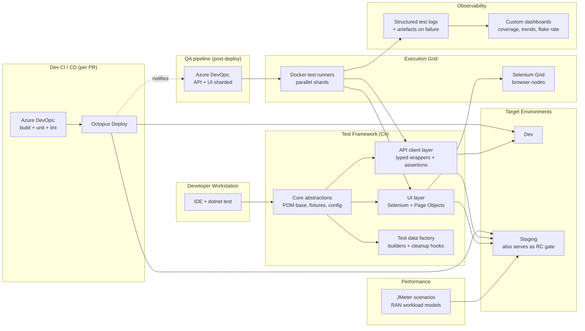

# System Architecture

> The components of the QA platform, what each one owned, and the seams between them.

---

## Component overview

---

## Component responsibilities

### Core abstractions
The shared foundation every test built on. Owned:
- **Configuration resolution** — env-aware (local / dev / staging), secret-free in code, layered overrides for local debugging.
- **Fixture lifecycle** — setup, teardown, and *cleanup-on-failure* (the easy-to-forget one).
- **Logging contract** — every test emitted a structured event stream that survived parallel shards without interleaving.
- **Retry and stability primitives** — explicit-wait helpers, idempotent API call wrappers, deterministic polling.

**Design rule:** if three tests needed the same helper, it belonged here. If two needed it, copy-paste was acceptable.

### API client layer
Typed C# wrappers over the product's REST surface. This was the **most-used** layer in the suite, so it earned the most care:

- One client class per service domain (not per endpoint).
- Builders for complex payloads, with sensible defaults.
- Assertion extensions co-located with each client (`response.ShouldBeAcceptedWithLocation()`) — readable in test bodies, reusable across teams.
- Versioned alongside the product's OpenAPI spec; contract drift surfaced at compile time, not at 2 a.m.

### UI layer (Selenium + POM)
- Page Object Model with **strict separation**: page objects exposed intent (`OnboardingPage.SubmitElement(...)`), never selectors.
- Selectors centralised in one file per page, so a UI refactor was a 1-file diff.
- All waits were explicit, conditional, and bounded — `Thread.Sleep` was a PR-block offence.
- Browser sessions ran against a Selenium Grid, never against a local browser in CI.

### Test data factory
- Builder pattern (`OperatorBuilder.WithTier(1).WithRegion("EU").Build()`) for readable test setup.
- Every builder produced data that registered itself for cleanup at teardown.
- Customer-shaped fixtures (anonymised real topologies) loaded from versioned JSON for high-realism integration tests.

### CI / CD (two pipelines, by design)

This platform did **not** run API and UI tests on the developer CI/CD. It ran them on a **separate QA pipeline**, owned by the QA platform team, against a deployed build on a shared environment. The split was deliberate — [test-execution-flow.md](./test-execution-flow.md) explains the full sequence and [ADR-0005](../decisions/0005-tests-as-blocking-gates.md) explains the trade-off.

- **Dev CI/CD (Azure DevOps):** per-PR. Build, static analysis, unit tests. Blocks merge. Fast (~3–5 min).
- **QA pipeline (separate Azure DevOps project):** post-deployment. API/integration suites and UI suites as **separate stages**, fanning out to parallel agents. Blocks release-candidate promotion, not PR merge.
- **Quality gates were blocking by default** — each pipeline against its own scope. The override path existed but required a recorded approval; friction was the point.
- **Octopus Deploy** handled multi-environment promotion. The same artefact promoted from dev → staging, never rebuilt; the same artefact then went to the operator-facing canary.

### Execution grid
- Docker containers ran the test framework itself; a single image, parameterised by the shard index and target environment.
- Selenium Grid handled browser orchestration, with Chrome and Firefox nodes scaled per release-week demand.
- Shard distribution was deterministic (by test fully-qualified name hash) so a failing shard could be re-run in isolation.

### Performance (JMeter)
Kept structurally separate from the functional suite. Different cadence (nightly, weekly), different gates (latency percentiles, not pass/fail), different audience (SRE + product). Mixing them into the per-commit pipeline would have made every build slow and every failure ambiguous.

### Observability
- **Structured logs** per test, aggregated per run, queryable per shard.
- **Artefacts on failure** — screenshots, browser console, HAR files, server-side correlation IDs — collected automatically and linked from the dashboard.
- **Dashboards** showed: pass rate trend, top 10 flaky tests, coverage by feature area, and *time-to-green* after a red build. The last metric was the most-watched.

---

## Seams worth calling out

Three boundaries in this architecture absorbed most of the maintenance cost, and getting them right paid off repeatedly:

### 1. Test code ↔ product API
The typed API client was the firewall. When the product changed an endpoint, exactly one place in the test code changed. Without this layer, every endpoint change would have rippled across hundreds of tests.

### 2. Page objects ↔ selectors
Selectors were the most volatile part of the suite. Isolating them per page meant a UI refactor was a small, reviewable diff — not a multi-day clean-up.

### 3. Tests ↔ environments
Environment configuration was injected, never hard-coded. A test that passed in dev had to be able to run, unchanged, against staging. This discipline is what made the multi-environment promotion in [test-execution-flow.md](./test-execution-flow.md) possible.

---

## What was intentionally left out

- **No shared mutable test database.** Each test owned its data and cleaned up. Shared state is a flake factory.
- **No record-and-playback tooling.** It generated tests faster than the team could maintain them. Net negative.
- **No custom DSL on top of C#.** The team already knew C#; a DSL would have been a tax on every new joiner.
- **No "smart" auto-healing selectors.** They hide breakage. We wanted breakage to be loud.
