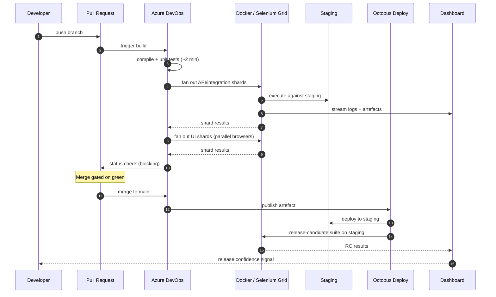
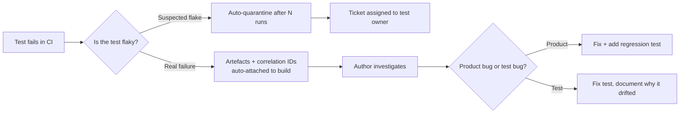

# Test Execution Flow

> What actually happens between a developer pressing `git push` and a release reaching a Tier 1 operator.

---

## End-to-end pipeline

---

## Stage-by-stage

### 1. Pre-commit (developer's machine)
- `dotnet test` on the changed module's unit tests — expected to be sub-second feedback.
- A small "smoke" subset of API tests targetable against a local Docker stack. Optional, but encouraged for risky changes.

The pre-commit stage was deliberately **lightweight**. Heavy gates here push developers to bypass them. The CI pipeline was the enforcement layer; the local environment was for fast iteration.

### 2. Pull request build (~5–8 minutes)
Triggered on every push to a PR branch.

| Step | Wall clock | Blocking? |
|---|---|---|
| Compile + static analysis | ~1 min | Yes |
| Unit tests | ~2 min | Yes |
| API / integration shards (×N) | ~3 min | Yes |
| Lint + format check | ~30 s | Yes |

API tests ran in parallel shards against an ephemeral staging slice. The shard count was tuned so that **any single shard finished in under 3 minutes** — that became the team's wall-clock budget for parallelisable work.

### 3. Pre-merge full suite (~12–18 minutes)
Triggered when a PR was marked ready-to-merge.

Adds:
- UI critical-path tests across Chrome + Firefox via Selenium Grid.
- Cross-service integration tests touching the message bus and multi-vendor adapters.
- Contract-verification tests against the published OpenAPI spec.

This was the **gate that mattered**. A red here blocked merge unconditionally — overrides required a recorded approval from the release lead, which happened a handful of times per quarter and was reviewed in retro.

### 4. Post-merge → staging deployment
On merge to main:
- Artefact built once, signed, published to the artefact repository.
- Octopus deploys the artefact to staging.
- Full regression suite runs against staging — same tests as pre-merge, but now against the integrated mainline.

If staging went red, the team's standing rule was **revert first, debug second**. The cost of an unstable mainline was higher than the cost of a re-merge.

### 5. Release-candidate validation on staging
There was no dedicated pre-prod tier (see [environments.md](./environments.md) for the honest discussion of that gap). On a defined cadence (initially weekly, later thrice-weekly):
- The artefact already running on staging was tagged as a release candidate — never rebuilt.
- A reduced **release-candidate suite** ran on staging: critical paths, the highest-risk multi-vendor flows, tenant-isolation checks, and the JMeter performance baseline.
- The RC suite was kept deliberately small by constant editing — every test in it had to justify its place.

### 6. Operator-facing release
Outside the scope of the test pipeline, but worth noting: the operator-facing rollout used canary deployments per region. Test telemetry from the staging RC run fed into the go/no-go conversation, alongside SRE signals. Without a pre-prod tier, the canary stage absorbed risk that would otherwise have been caught earlier.

---

## Quality gates and their authority

The pipeline enforced four gates. Each one had an explicit owner and an explicit override path:

| Gate | Owner | Override path |
|---|---|---|
| Unit + static analysis | Author | None — fix or revert |
| API/integration on PR | Author + reviewer | None |
| Full suite pre-merge | Reviewer | Release lead, recorded in PR |
| Staging regression | Release lead | Revert, no override |

The principle: **the further the code travels from the author, the harder the gate becomes**. By the time a build reached the release-candidate suite on staging, the gates were unforgiving — because the next stop was an operator-facing canary.

---

## How failures were handled

A red build wasn't an event; it was a workflow.

**Flake quarantine** was the safety valve. A test that failed inconsistently across N consecutive runs was auto-tagged "quarantined" — it still ran, still reported, but didn't block the gate. The owning team had a fixed window to fix or delete it. Tests that lingered in quarantine past the window were **deleted**, not muted. Muting forever is how suites rot.

---

## What the metrics actually were

Numbers from the stabilised Phase 2 state:

- **PR build median:** ~6 min
- **Full pre-merge suite median:** ~15 min
- **Staging regression median:** ~22 min (more services, fuller data)
- **Release-candidate suite on staging:** ~45 min including JMeter baseline
- **Flake rate (rolling 7-day):** held under 2% — anything higher triggered a stability sprint
- **Time-to-green after a red main:** median ~40 min, p95 under 2 hours

These weren't aspirational. They were the operating envelope the pipeline was designed and tuned for, and the dashboards were watched against them.
