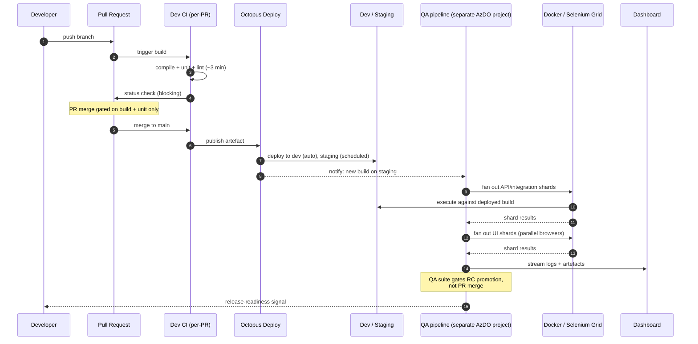
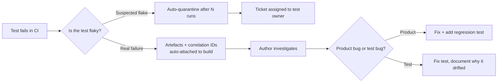

# Test Execution Flow

> What actually happens between a developer pressing `git push` and a release reaching a Tier 1 operator.

> **Important framing.** This platform ran on **two separate pipelines**, not one. The **dev CI/CD** (owned by dev teams) handled build, static analysis and unit tests on every PR. The **QA pipeline** (a separate Azure DevOps project, owned by the QA platform team) ran API/integration and UI tests against a *deployed* build on a shared environment. The two were stitched together by the build artefact and Octopus Deploy. Most of the architectural discussions in this section make more sense once that split is clear.

---

## End-to-end pipeline

---

## Stage-by-stage

### 1. Pre-commit (developer's machine)
- `dotnet test` on the changed module's unit tests — expected to be sub-second feedback.
- A small "smoke" subset of API tests targetable against a local Docker stack. Optional, but encouraged for risky changes.

The pre-commit stage was deliberately **lightweight**. Heavy gates here push developers to bypass them. The dev CI was the enforcement layer for code health; the local environment was for fast iteration.

### 2. Dev CI — pull request build (~3–5 minutes)
Triggered on every push to a PR branch. Owned by the dev teams.

| Step | Wall clock | Blocking? |
|---|---|---|
| Compile + static analysis | ~1 min | Yes |
| Unit tests | ~2 min | Yes |
| Lint + format check | ~30 s | Yes |

**API and UI tests did not run here.** That was a deliberate boundary. The dev CI had to stay fast enough that developers never resented it; the moment it crossed ~5 minutes, the political pressure to skip gates would have collapsed everything else.

On merge to main, the dev CI built and published the artefact once, signed it, and handed off to Octopus.

### 3. Deployment to shared environments
- Octopus deployed the artefact to **dev** automatically on every main-branch build.
- Octopus deployed the artefact to **staging** on a scheduled cadence (initially daily, later twice-daily) — the same artefact, never rebuilt.
- The deployment to staging is what triggered the QA pipeline.

### 4. QA pipeline — API + integration (~5–8 minutes)
A **separate Azure DevOps project**, owned by the QA platform team. Triggered by a successful Octopus deployment to staging, not by PR events.

- Sharded across N parallel agents (typically 4) against the freshly deployed staging build.
- The shard count was tuned so that **any single shard finished in under 3 minutes** — that became the team's wall-clock budget for parallelisable work.
- Failures here did not roll back the deployment automatically, but they did **block release-candidate promotion** (stage 6).

### 5. QA pipeline — UI critical paths (~10–15 minutes)
Kicked off automatically after the API shards went green for a given build.

- UI critical-path tests across Chrome + Firefox via Selenium Grid.
- Cross-service integration tests touching the message bus and multi-vendor adapters.
- Contract-verification tests against the published OpenAPI spec.

This was the **gate that mattered for release readiness**. A red here blocked RC promotion unconditionally — overrides required a recorded approval from the release lead, which happened a handful of times per quarter and was reviewed in retro.

### 6. Release-candidate validation on staging
There was no dedicated pre-prod tier (see [environments.md](./environments.md) for the honest discussion of that gap). On a defined cadence (initially weekly, later thrice-weekly):
- The artefact already running on staging — the one the QA pipeline had vetted — was tagged as a release candidate. Never rebuilt.
- A reduced **release-candidate suite** ran on staging: critical paths, the highest-risk multi-vendor flows, tenant-isolation checks, and the JMeter performance baseline.
- The RC suite was kept deliberately small by constant editing — every test in it had to justify its place.

### 7. Operator-facing release
Outside the scope of the test pipelines, but worth noting: the operator-facing rollout used canary deployments per region. Test telemetry from the staging RC run fed into the go/no-go conversation, alongside SRE signals. Without a pre-prod tier, the canary stage absorbed risk that would otherwise have been caught earlier.

---

## Quality gates and their authority

The two pipelines together enforced four gates. Each one had an explicit owner, an explicit pipeline, and an explicit override path:

| Gate | Pipeline | Owner | Override path |
|---|---|---|---|
| Unit + static analysis on PR | Dev CI | Author | None — fix or revert |
| API/integration on deployed build | QA pipeline | QA platform team | None for RC promotion; main-branch stays green |
| UI critical paths on deployed build | QA pipeline | QA platform team | Release lead, recorded |
| Staging RC suite | QA pipeline | Release lead | Revert, no override |

The principle: **the further the code travels from the author, the harder the gate becomes**. By the time a build reached the release-candidate suite on staging, the gates were unforgiving — because the next stop was an operator-facing canary.

This split also has a less-flattering consequence: a regression introduced in a PR did not surface until *after* merge, when the QA pipeline ran. The team accepted this trade because the alternative — putting API and UI tests on every PR — would have pushed PR feedback past ~20 minutes and broken the dev-CI bargain. See [ADR-0005](../decisions/0005-tests-as-blocking-gates.md) for the full reasoning.

---

## How failures were handled

A red build wasn't an event; it was a workflow.

**Flake quarantine** was the safety valve. A test that failed inconsistently across N consecutive runs was auto-tagged "quarantined" — it still ran, still reported, but didn't block the gate. The owning team had a fixed window to fix or delete it. Tests that lingered in quarantine past the window were **deleted**, not muted. Muting forever is how suites rot.

---

## What the metrics actually were

Numbers from the stabilised Phase 2 state:

- **Dev CI (PR build) median:** ~4 min
- **QA pipeline API shards median:** ~7 min wall-clock against a deployed build
- **QA pipeline UI suite median:** ~15 min across Chrome + Firefox
- **Staging RC suite median:** ~45 min including JMeter baseline
- **Flake rate (rolling 7-day):** held under 2% — anything higher triggered a stability sprint
- **Time-to-green after a red main:** median ~40 min, p95 under 2 hours
- **Lead time from PR merge to first QA verdict:** ~25–35 min (deploy to staging + QA pipeline). This is the cost of the two-pipeline split, and it was tracked.

These weren't aspirational. They were the operating envelope the pipelines were designed and tuned for, and the dashboards were watched against them.
