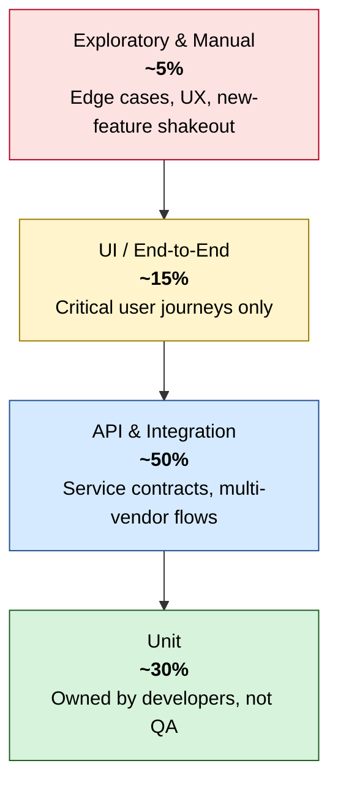

# Testing Pyramid

> The shape of the test suite — and why it deliberately differs from the textbook diagram.

---

## The shape we settled on

If you've seen the classic Mike Cohn pyramid, you'll notice this one is **API-heavy**, not unit-heavy. That was a deliberate response to the domain.

---

## Why API/integration was the centre of gravity

In a telecom automation platform, the value is in **how services compose**: a RAN configuration request might touch 6 internal services, 2 vendor adapters, a message bus, and a persistence layer before producing an observable result. A perfect unit-test suite tells you nothing about whether that orchestration works.

The API layer was the cheapest place to catch:

- **Contract drift** between internal services (the most common source of regressions).
- **Vendor adapter regressions** when a multi-vendor manager was updated.
- **Permissioning and tenant-isolation bugs** — critical for SaaS-to-operator deployments.

A unit test couldn't see these. A UI test could, but at 20–50× the runtime and 5× the flake rate.

---

## Why the UI layer was kept deliberately thin

UI tests are expensive to write, slow to run, and the first to break when a designer reshuffles a screen. We capped UI automation at **critical user journeys** — the handful of flows that, if broken, would page an on-call engineer:

- Operator login + tenant selection
- Network element onboarding wizard
- Alarm acknowledgement and escalation
- Configuration rollout (preview → apply → rollback)
- Audit log retrieval

Everything else — form validation, table sorting, modal behaviour — was pushed down to component or API tests where it ran 10× faster and didn't depend on a browser.

This is the single decision that did the most to keep the regression suite under a 20-minute wall clock.

---

## Why unit tests were owned by developers

In Phase 1 it was tempting for QA to write unit tests "to get coverage up." We didn't. Reasons:

1. **Ownership.** A unit test written by QA against someone else's code becomes a maintenance burden on the wrong team. When the implementation refactors, the test breaks, and nobody owns the fix.
2. **Signal.** Unit-test coverage written *after* the fact tends to mirror the implementation rather than the intent. It catches refactors, not bugs.
3. **Culture.** The Phase 3 goal was developers owning quality. QA writing their unit tests would have undermined exactly that.

QA's role at the unit layer was to **review coverage trends**, flag gaps in critical modules, and pair with developers on testability — not to write the tests themselves.

---

## What deliberately stayed manual

Roughly 5% of QA effort stayed manual, by design:

| Category | Why manual |
|---|---|
| **Exploratory testing** on new features | Humans find what scripts can't imagine |
| **UX and visual regression** on customer-facing dashboards | Cheaper than maintaining pixel-diff infra for a low-frequency surface |
| **First-time vendor integration smoke** | Vendor labs were unstable; automation here amortised badly |
| **Pre-release operator-facing rehearsal** | Customers expect a human in the loop for go-live |

The principle: **automate what is repetitive and well-defined; leave humans for what is creative or judgment-bound.**

---

## The bug severity matrix (decision aid)

Not every bug deserves an automated test. The matrix below was the team's tie-breaker:

| Severity | Recurrence risk | Automate? |
|---|---|---|
| Sev 1 (outage) | Any | **Yes — always, immediately** |
| Sev 2 (degraded function) | High (touches shared code) | **Yes** |
| Sev 2 | Low (one-off integration) | Manual regression, document |
| Sev 3 (UX / cosmetic) | High | Component or visual test |
| Sev 3 | Low | Don't automate |
| Sev 4 (nice-to-have) | Any | Don't automate |

This kept the suite from drowning in low-value tests — the slow death of every QA automation effort.

---

## What this pyramid did *not* solve

Worth being honest about:

- **Performance regressions** are not visible in this pyramid. They lived in a separate JMeter-driven suite, run nightly, gated separately. See [system-architecture.md](./system-architecture.md).
- **Long-running stability tests** (24h+ soak tests for RAN scenarios) ran on a weekly cadence, not per-commit.
- **Chaos / failure-injection testing** was on the roadmap when this case study ends. Not a victory to claim.
